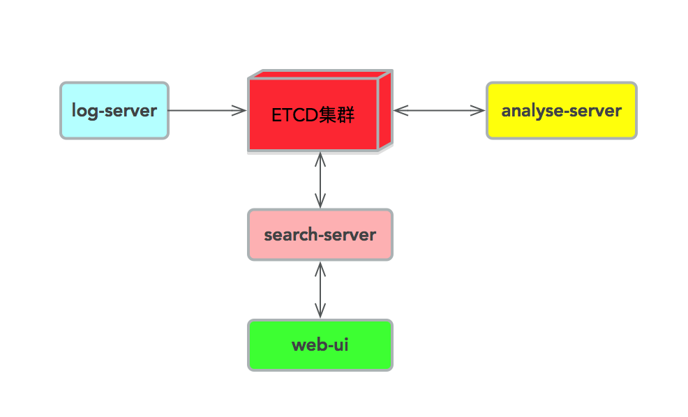

# log-server-note
日志采集服务设计笔记

## 背景

* log-server服务器致力于统一化日志报文数据采集入库；
* 提供TCP方式接收指定格式日志报文和主动采集指定日志文件两种方式；
* 支持自身配置动态更新；
* 支持并发采集日志数据；

## 规范

* 采用TCP方式连接log-server时，传输的数据报文格式为JSON，但必须包含关键字段: time(日志记录时间，精确到纳秒)和identity(模块标识，一般按大模块区分)；
* 主动采集指定目录日志时，要求该日志文件中每条日志的格式必须由多个`key=value`组成(之间用空格隔开)，需要手动指定identity；
* log-server要求强制日志格式，这样采集完成后，为后续日志分析和展示做铺垫；

## 设计

* frame设计

* log-server设计

* etcd数据库设计

## 启动

